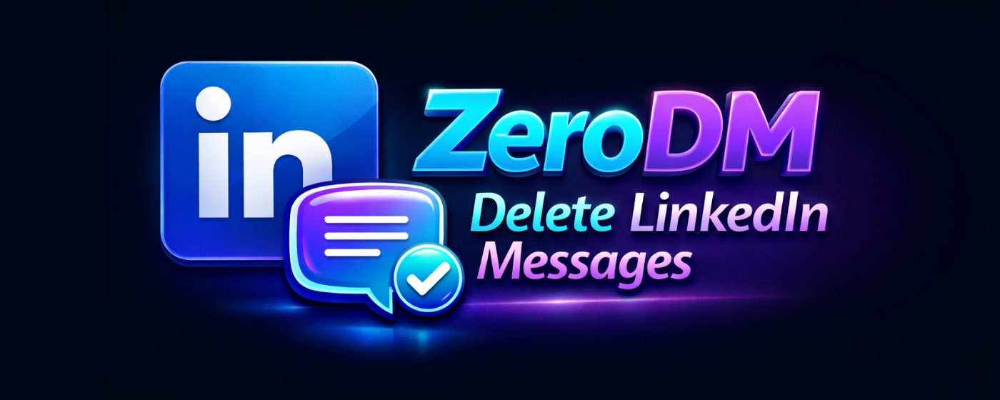
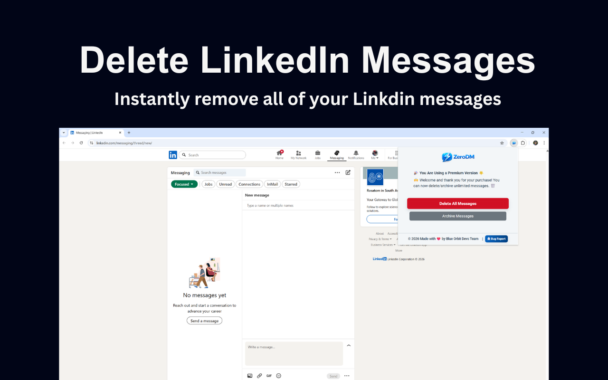

<p align="center">
  <a href="https://chrome.google.com/webstore/detail/ikeljpanipmafhjfjobiihclbkjncagn" target="_blank">
    
  </a>
</p>

<p align="center">
  <b>Clean your LinkedIn DMs in seconds — remove unwanted conversations, stay organized, and protect your privacy.</b>
</p>

<h1 align="center">ZeroDM – Delete LinkedIn Messages</h1>

<p align="center">
  <b>Bulk Delete LinkedIn DMs • Clutter-Free Inbox • Professional Message Cleanup</b><br>
  Version 1.0.0 • Developed by <a href="https://amitdas.site">Amit Das</a>
</p>

---

## 🧩 Overview

**ZeroDM – Delete LinkedIn Messages** is a fast, secure, and privacy-focused Chrome extension designed to help you **clean and manage your LinkedIn Direct Messages effortlessly**.

LinkedIn inboxes often become cluttered with connection requests, recruiter messages, promotions, and inactive conversations. Manually deleting chats one by one is slow and frustrating. ZeroDM solves this by allowing you to **bulk-delete unwanted LinkedIn message conversations directly in your browser**, saving time while keeping your data private.

All actions run **locally** — no tracking, no external servers, and no data sharing.

---

## ⬇️ Download Extension

Get the latest version of **ZeroDM** from the **Chrome Web Store** or **GitHub Releases**.

<p align="center">
  <a href="https://chrome.google.com/webstore/detail/ikeljpanipmafhjfjobiihclbkjncagn" target="_blank">
    
  </a>
  &nbsp;&nbsp;
  <a href="https://github.com/AmitDas4321/ZeroDM-Delete-LinkedIn-Messages/releases/download/v1.0.0/ZeroDM.crx">
    
  </a>
</p>

### 🧭 Manual Installation Steps

1. Download the `.crx` file *(or install directly from the Chrome Web Store)*
2. Open `chrome://extensions/`
3. Enable **Developer Mode** (top-right corner)
4. Drag and drop the `.crx` file
5. ZeroDM installs automatically ✅

---

## ⚙️ Features

✅ **Bulk Message Cleanup**

* Delete multiple LinkedIn DM conversations at once
* Remove inactive or unwanted chats quickly

✅ **Fast & Automated**

* One-click cleanup
* Live progress indicator
* Pause or stop anytime

✅ **Privacy-First Design**

* Runs 100% locally in your browser
* **No tracking, no analytics, no external servers**

✅ **Clean & Simple UI**

* Minimal interface that blends naturally with LinkedIn
* Easy to use for professionals and everyday users

---

## 🖼️ Screenshots

### ✨ Main Message Cleanup

<p align="center"></p>

### ✨ Cleanup in Progress

<p align="center"></p>

---

## 🔒 Privacy & Security

* ZeroDM does **not** collect, store, or transmit personal data
* No access to LinkedIn credentials
* No analytics, ads, or tracking
* All actions execute locally inside your browser

Read the full **Privacy Policy** in `PRIVACY.md`.

---

## 🧰 Permissions Used

| Permission | Purpose                                             |
| ---------- | --------------------------------------------------- |
| `storage`  | Saves user preferences and cleanup state locally    |
| `tabs`     | Detects LinkedIn DM tabs for user-initiated actions |

**Host Permissions:**

```
*://*.linkedin.com/*
```

→ Required only to interact with LinkedIn Direct Messages for cleanup.

---

## 💬 Support

Have questions, issues, or feature requests?
📧 **Email:** [info@amitdas.site](mailto:info@amitdas.site)

---

## 📜 License

© 2025 **Amit Das**
All rights reserved. Redistribution or modification without permission is prohibited.

---

<p align="center">
  <b>Made with ❤️ by <a href="https://amitdas.site">Amit Das</a></b><br>
  ☕ Support development: <a href="https://paypal.me/AmitDas4321">PayPal.me/AmitDas4321</a>
</p>
